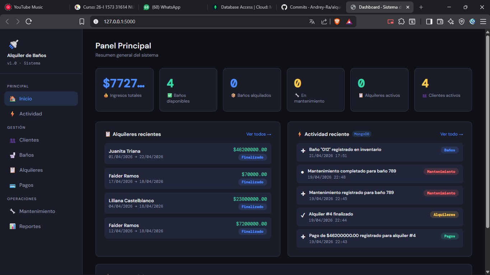
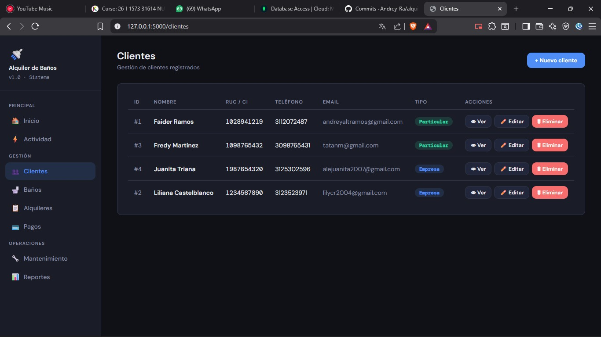
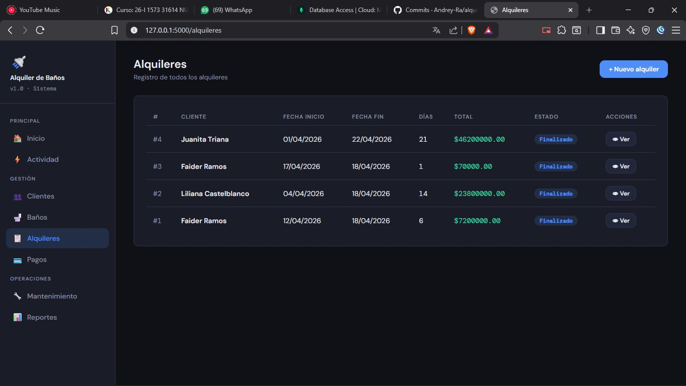
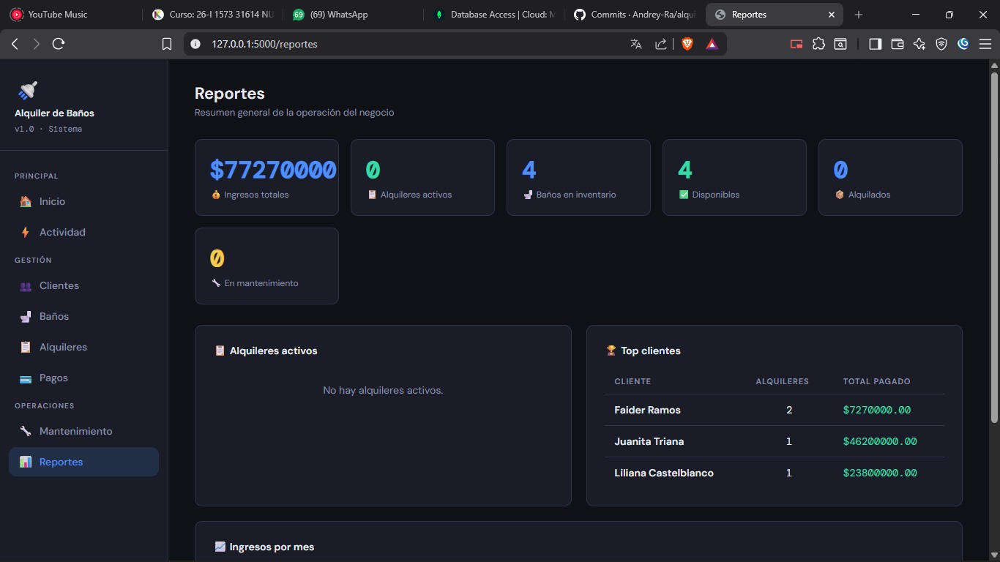
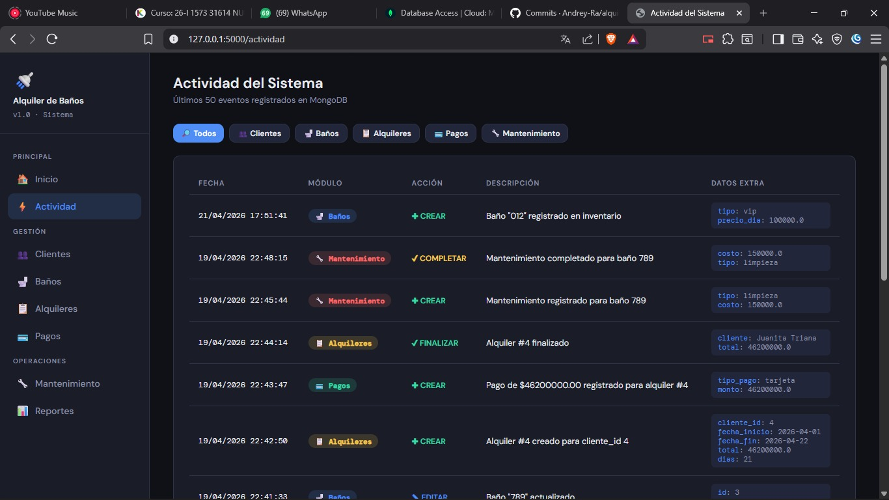
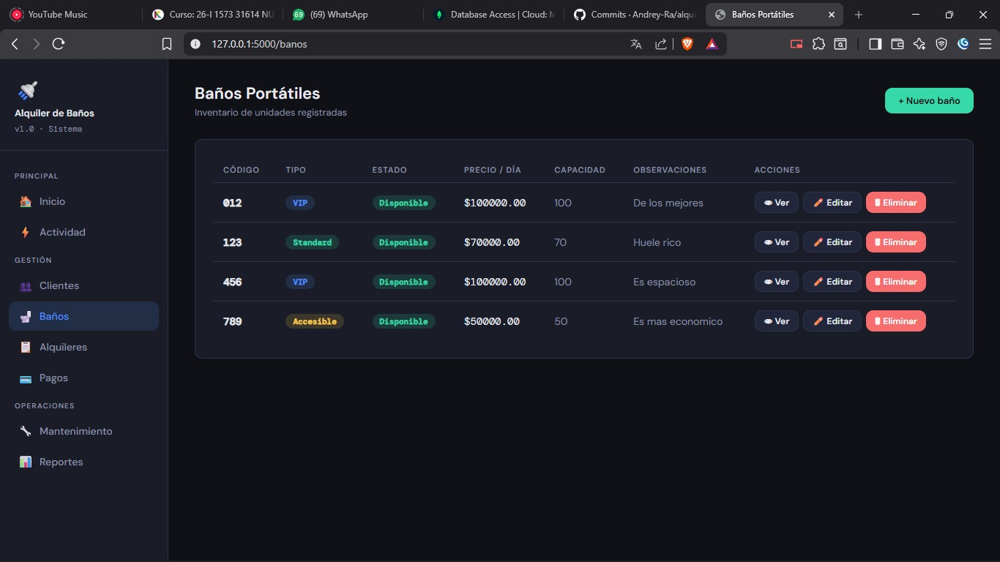
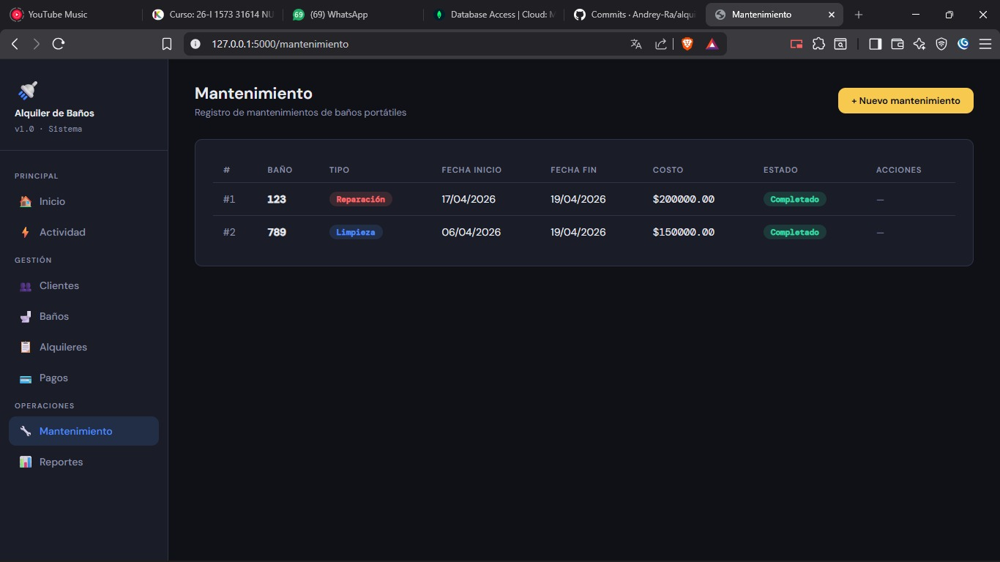
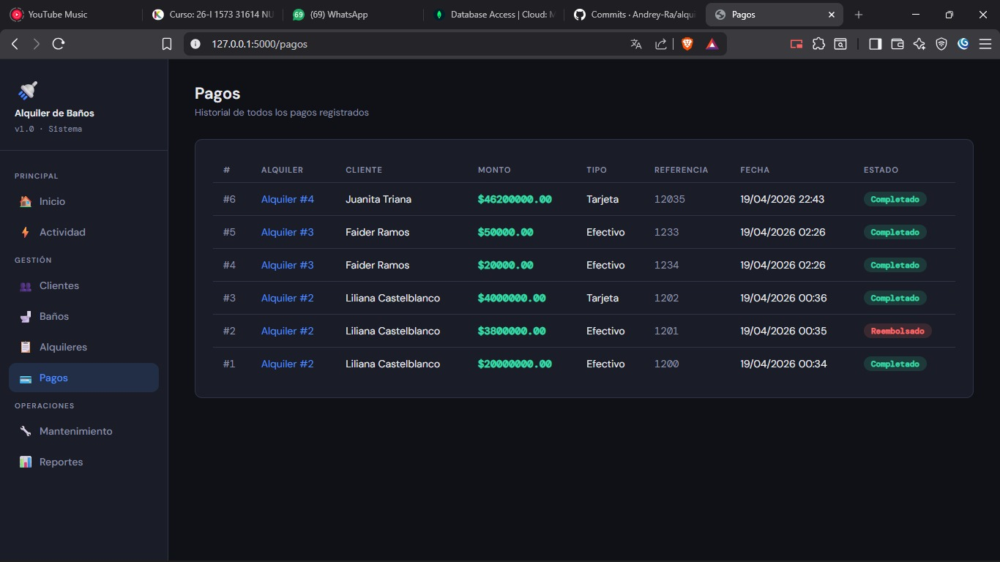

# Sistema de Alquiler de Baños Portátiles

Proyecto final desarrollado para la materia **Nuevas Tecnologías del Desarrollo** - Fundación Universitaria Konrad Lorenz.

## Descripción

Sistema web para gestionar de forma integral el proceso de alquiler de baños portátiles. Desarrollado con **persistencia políglota**: SQLite para datos estructurados del negocio y MongoDB para logs de actividad en tiempo real.

## Tecnologías

| Capa | Tecnología |
|---|---|
| Backend | Python 3 + Flask |
| Base de datos relacional | SQLite + SQLAlchemy |
| Base de datos documental | MongoDB Atlas |
| ORM | Flask-SQLAlchemy |
| Frontend | HTML5 + CSS3 (Jinja2) |
| Control de versiones | Git + GitHub |
| Despliegue | Render |

## Estructura del Proyecto

alquiler_banos/
├── static/
│   └── styles.css
├── templates/
│   ├── base.html
│   ├── index.html
│   ├── clientes.html
│   ├── nuevo_cliente.html
│   ├── editar_cliente.html
│   ├── detalle_cliente.html
│   ├── banos.html
│   ├── nuevo_bano.html
│   ├── editar_bano.html
│   ├── detalle_bano.html
│   ├── alquileres.html
│   ├── nuevo_alquiler.html
│   ├── detalle_alquiler.html
│   ├── pagos.html
│   ├── nuevo_pago.html
│   ├── mantenimiento.html
│   ├── nuevo_mantenimiento.html
│   ├── reportes.html
│   └── actividad.html
├── app.py
├── config.py
├── models.py
├── requirements.txt
├── .env
└── .gitignore

## Instalación y ejecución local

### 1. Clonar el repositorio
```bash
git clone https://github.com/TU_USUARIO/alquiler-banos.git
cd alquiler-banos
```

### 2. Crear y activar el entorno virtual
```bash
python -m venv venv

# Windows
venv\Scripts\activate

# Mac / Linux
source venv/bin/activate
```

### 3. Instalar dependencias
```bash
pip install -r requirements.txt
```

### 4. Configurar variables de entorno
Crea un archivo `.env` en la raíz del proyecto con esto: MONGO_URI=tu_uri_de_mongodb_atlas

### 5. Ejecutar el proyecto
```bash
python app.py
```

Abre el navegador en `http://localhost:5000`

## Modelo de datos

### SQLite — Datos del negocio
| Tabla | Descripción |
|---|---|
| `cliente` | Clientes registrados en el sistema |
| `bano_portatil` | Inventario de baños portátiles |
| `alquiler` | Registro de alquileres |
| `detalle_alquiler` | Baños incluidos en cada alquiler |
| `pago` | Pagos asociados a alquileres |
| `mantenimiento` | Registros de mantenimiento |
| `usuario` | Usuarios del sistema |

### MongoDB — Logs de actividad
```json
{
  "_id": "ObjectId",
  "accion": "crear | editar | eliminar | finalizar | completar",
  "modulo": "clientes | banos | alquileres | pagos | mantenimiento",
  "descripcion": "Texto legible del evento",
  "fecha": "DateTime UTC",
  "datos_extra": {}
}
```

## Módulos del sistema

- **Dashboard** — Resumen general con estadísticas en tiempo real
- **Clientes** — CRUD completo con historial de alquileres
- **Baños** — Inventario con control de estados
- **Alquileres** — Registro con cálculo automático de costos
- **Pagos** — Gestión de pagos por alquiler
- **Mantenimiento** — Control de mantenimientos
- **Reportes** — Ingresos, top clientes y estado del inventario
- **Actividad** — Log en tiempo real desde MongoDB

## Persistencia Políglota

SQLite  →  Datos estructurados del negocio (clientes, baños, alquileres)
MongoDB →  Logs de actividad y eventos del sistema
Flask   →  Consulta ambas bases y combina los datos en las vistas

## Capturas de pantalla

### Dashboard


### Clientes


### Alquileres


### Reportes


### Actividad


### Baños


### Mantenimiento


### Pagos

## Autor

**Faider Andrey Ramos Castelblanco**  
Fundación Universitaria Konrad Lorenz  
Facultad de Matemáticas e Ingenierías  
Nuevas Tecnologías del Desarrollo - Grupo 2  
2026

## Docente

**Leandro Pajaro Fuentes**